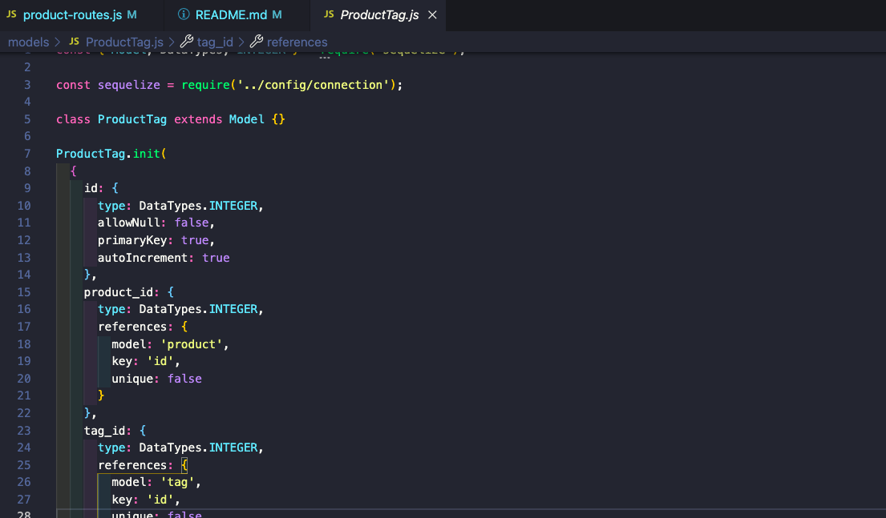
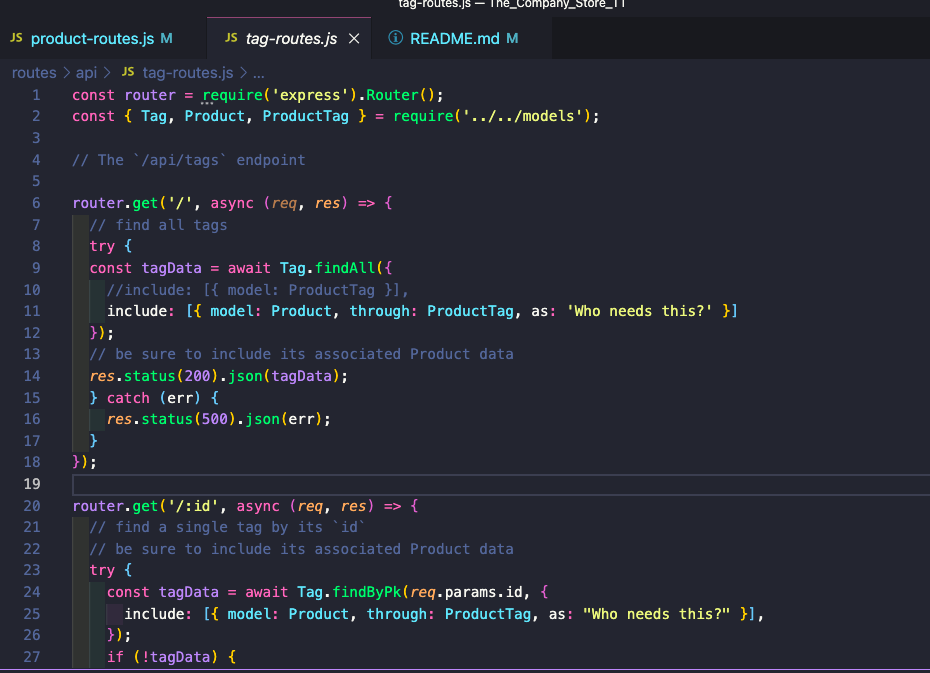
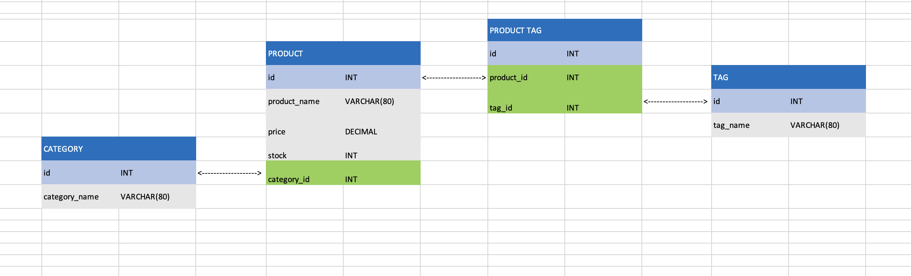

# The_Company_Store_TT

  ## Table of Contents
  * [Description](#descrip)
  * [Installation](#install)
  * [Usage](#usage)
  * [Contributions](#contri)
  * [Tests](#tests)
  * [Contact & Qustions](#contact)
  * [License](#license)
  * [Powered By](#powered-by)
  
  ### Description:
      Help with the backend of an e-commerce store and get all the routes working as well as the associations.

Part1

Part2

  
  ### Installation:
      It is run in the command line with "npm start watch"

 

  
  ### Usage: 
      Backend of a store

 

 

  
  ### Contributions:
      N/A

  
  ### Tests
      N/A

  
  ### Contact & Qustions
  If you have any questions, suggestions or concerns, please contact me at:  
  GitHub  
  https://github.com/DerTodd  
  email  
      todd.taylor@utexas.edu  

  
  ### License:
  [MIT](https://opensource.org/licenses/MIT)

  
  #### Powered By
    
    
   
